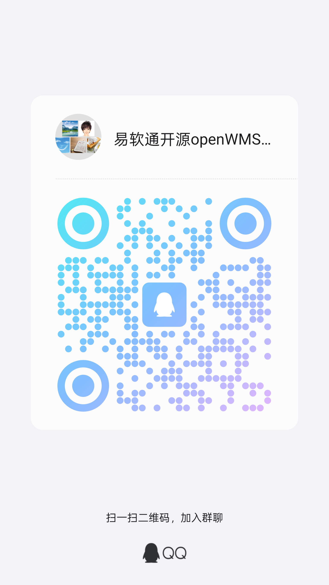

<div style="height: 10px; clear: both;"></div>

<div align="center">


[](https://gitee.com/yiruantong/open-wms)
[](https://gitee.com/yiruantong/open-wms)
[](https://gitee.com/yiruantong/open-wms/blob/master/LICENSE)
[](https://www.jetbrains.com/?from=RuoYi-Vue-Plus)
<br>
[](https://gitee.com/yiruantong/open-wms)
[]()
[]()
[]()

[官网](https://www.wms.kim/) |
[在线体验](http://open.wms.kim) |
[帮助文档](https://www.yuque.com/xietianbao/xc91gm) |
[技术社区](https://gitee.com/yiruantong/open-wms/issues)

[comment]: <> ([宽屏预览]&#40;https://gitee.com/yiruantong/open-wms/blob/master/README.md&#41;)
</div>


- - -

# 易软通开源免费openWMS系统简介

> 易软通openWMS是采用RuoYi-Vue-Plus作为后端Java框架，已做调整不兼容原框架；前端采用Vue3 + VueX + Vue-Router + Element Plus + Pinia + TypeScript + Axios + Vite为前端框架。

> 项目代码、文档均开源免费可商用 遵循开源协议在项目中保留开源协议文件即可

> 易软通WMS系统，名称中“易”代表便捷、“软”代表软件、“通”代表畅通无阻，整体寓意系统操作简便、信息流畅、功能全面。在WMS（Warehouse Management System，仓库管理系统）行业中，易软通商标名体现了我们致力于为企业提供高效、智能、易用的仓储管理解决方案。
>
> 易软通WMS系统，不仅是一套管理工具，更是企业物流与仓储管理的智能伙伴。它像其名称所寓意的那样，帮助企业打通仓储管理各个环节，实现信息无缝对接与流程高效协同。系统实时监控库存状态、货物动向及作业进度，为企业提供精准的数据分析和可靠的决策支持。
>
> 易软通WMS系统的强大功能，助力企业轻松应对多样化的物流挑战。无论是日常订单的高效处理，还是突发状况的快速响应，系统都能灵活适配、稳定运行，保障企业仓储物流始终顺畅高效。
>
> 易软通WMS系统，凭借其出色的易用性、灵活的适应性和稳定的性能，已成为WMS领域中广受信赖的选择。它始终关注行业发展趋势，持续推动企业仓储管理数字化、智能化转型。选择易软通WMS系统，就是选择一位高效、可靠、智能的合作伙伴，助您在日益激烈的市场竞争中稳步前行。

## PC端演示地址
> WMS系统: http://open.wms.kim <br/>
> 账号/密码：请点击star后，获取作者账号密码 <br/>

## 帮助文档
> 易软通openWMS帮助文档: https://www.yuque.com/xietianbao/xc91gm <br/>

## 🌈 当前代码仓库是易软通openWMS前端UI

基于 vue3.x + CompositionAPI setup 语法糖 + typescript + vite + element plus + vue-router-next + pinia 技术，希望给大家减少工作量，帮助大家实现快速开发仓储管理系统，让开发更轻松。


## 💒 代码仓库

- 开源openWMS前端UI <a href="https://gitee.com/yiruantong/open-wms-ui" target="_blank">https://gitee.com/yiruantong/open-wms-ui</a>
- 开源openWMS后端Java <a href="https://gitee.com/yiruantong/open-wms" target="_blank">https://gitee.com/yiruantong/open-wms</a>


## 🏭 环境支持

| Edge      | Firefox      | Chrome      | Safari      |
| --------- | ------------ | ----------- | ----------- |
| Edge ≥ 88 | Firefox ≥ 78 | Chrome ≥ 87 | Safari ≥ 13 |

> 由于 Vue3 不再支持 IE11，故而 ElementPlus 也不支持 IE11 及之前版本。

## ⚡ 使用说明

建议使用 pnpm <a href="http://nodejs.cn/" target="_blank">node 版本 > 14.18+/16+</a>

> Vite 不再支持 Node 12 / 13 / 15，因为上述版本已经进入了 EOL 阶段。现在你必须使用 Node 14.18+ / 16+ 版本。

```bash
# 克隆项目
git clone https://gitee.com/yiruantong/open-wms-ui

# 进入项目
cd open-wms-ui

# 安装依赖
npm install

# 运行项目
npm run dev

# 打包发布
npm run build
```

#### 📚 开发文档

- 查看开发文档：<a href="https://www.yuque.com/xietianbao/xc91gm" target="_blank">https://www.yuque.com/xietianbao/xc91gm</a>


# 企业版WMS链接地址
> [https://www.wms.kim/enterprise-wms](https://www.wms.kim/enterprise-wms/)

# QQ群
<a href="http://qm.qq.com/cgi-bin/qm/qr?_wv=1027&k=g035KL0OrSeWwWqxKmCDSkQgxGRA9PaW&authKey=Va2o57thdynX1XdLMvpkYPPiWAKrJc6gESRHPOwtAiGLW%2BrMqvB3iE6cH1LJ9s0X&noverify=0&group_code=835488048" target="_blank">点击链接加入群聊【易软通openWMS沟通群】</a>
<br/>

